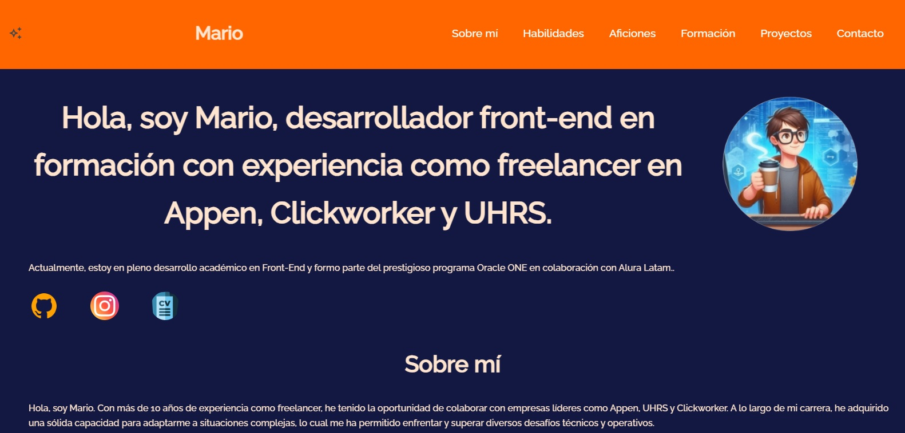

# Challenge ONE | Front End - Portafolio

## 📄 Descripción

Este proyecto es un **portafolio web** creado como parte del curso **Alura ONE - Especialización FrontEnd**. El objetivo principal es demostrar habilidades avanzadas en desarrollo web, aplicando conocimientos en **HTML**, **CSS** y **JavaScript**. Este portafolio presenta mi experiencia, habilidades y proyectos, mostrando un diseño atractivo y funcional que se adapta a diferentes dispositivos.

## 💻 Tecnologías Usadas

-    **HTML**
- **CSS**
-  **JavaScript**

## 🚀 Características

- **Diseño Responsivo:** Compatible con dispositivos móviles y de escritorio.
- **Interactividad:** Utiliza JavaScript para interacciones dinámicas.
- **Estilo Atractivo:** Aplicación de técnicas avanzadas de CSS para un diseño moderno.

## 📸 Capturas de Pantalla


*Portafolio en acción*

## 🛠 Instalación y Uso

1. Clona el repositorio:
    ```bash
    git clone https://github.com/MarioDev0596/challenge-portfolio-web.git
    ```

2. Navega al directorio del proyecto:
    ```bash
    cd challenge-portfolio-web
    ```

3. Abre el archivo `index.html` en tu navegador para ver el portafolio en acción.

## 🌐 Enlaces

- [Repositorio en GitHub](https://github.com/MarioDev0596/challenge-portfolio-web)

## 🤝 Contribuciones

Si deseas contribuir a este proyecto, por favor, sigue estos pasos:
1. Haz un fork del repositorio.
2. Crea una nueva rama (`git checkout -b feature/nueva-caracteristica`).
3. Realiza tus cambios y haz un commit (`git commit -am 'Añadir nueva característica'`).
4. Haz un push a tu rama (`git push origin feature/nueva-caracteristica`).
5. Abre un Pull Request.

## 📫 Contacto

Para cualquier consulta, puedes contactarme a través de [GitHub](https://github.com/MarioDev0596)

---

© 2024 Desarrollado por MarioDev0596
